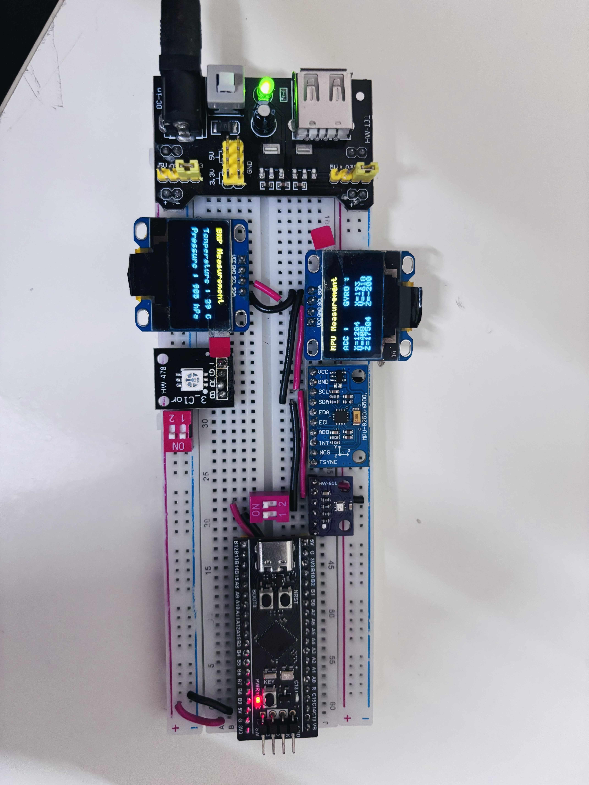

# MPU6500 & BMP280 Sensor Data Display on Dual OLEDs

## Project Overview

This project demonstrates interfacing two sensors, the MPU6500 (a 6-axis IMU sensor) and the BMP280 (a barometric pressure and temperature sensor), with a microcontroller over the I2C bus. The sensor data is collected and displayed simultaneously on two separate SSD1306 OLED displays.

The entire project is implemented using custom-written drivers and APIs for the MPU6500, BMP280, and SSD1306 OLED displays. The code is modularized into sensor-specific and display-specific files, making it easy to understand and extend.

---

## Hardware Components

- MPU6500 6-axis IMU sensor (accelerometer + gyroscope)
- BMP280 barometric pressure and temperature sensor
- Two SSD1306 OLED displays (I2C interface)
- Microcontroller (not specified, but assumed to support I2C)
- Breadboard and connecting wires

---

## Software Structure

The project source code is organized as follows:

- `mpu6500.c` and `mpu6500_ll.c`: MPU6500 sensor driver and low-level I2C communication
- `bmp280.c` and `bmp280_ll.c`: BMP280 sensor driver and low-level I2C communication
- `SSD1306.c` and `SSD1306_ll.c`: SSD1306 OLED display driver and low-level I2C communication
- `ssd1306_fonts.c`: Font definitions for displaying characters on OLED
- `main.c`: Main application logic that initializes sensors and displays, reads sensor data, and updates the OLEDs

---

## Detailed Explanation of `main.c`

The `main.c` file is the core of the project, orchestrating sensor initialization, data acquisition, and display updates. Below is a step-by-step explanation of its functionality:

1. **Initialization:**
   - The I2C peripheral is initialized to communicate with the sensors and OLED displays.
   - The MPU6500 sensor is initialized using the custom MPU6500 API. This includes setting up the sensor registers for accelerometer and gyroscope operation.
   - The BMP280 sensor is initialized similarly, configuring it for temperature and pressure measurement.
   - Both SSD1306 OLED displays are initialized independently using the SSD1306 API. Each display is configured for I2C communication and prepared to show graphical data.

2. **Main Loop:**
   - The program enters an infinite loop where it continuously performs the following:
     - Reads accelerometer and gyroscope data from the MPU6500 sensor.
     - Reads temperature and pressure data from the BMP280 sensor.
     - Formats the sensor data into human-readable strings.
     - Clears the OLED display buffers.
     - Writes the formatted MPU6500 data to the first OLED display.
     - Writes the formatted BMP280 data to the second OLED display.
     - Updates both OLED displays to show the latest sensor readings.
     - Introduces a delay to control the update rate.

3. **Error Handling:**
   - The code includes basic error checking after sensor initialization and data reads to ensure reliable operation.

4. **Modularity:**
   - The use of separate driver files for each sensor and display allows easy maintenance and potential reuse in other projects.

---

## API References

For detailed information on the APIs used in this project, please refer to the following links:

- [SSD1306 OLED Display API Reference](https://github.com/Lucky8882/SSD1306_drivers)
- [MPU6500 Sensor API Reference](https://github.com/Lucky8882/BMP280_drivers)
- [BMP280 Sensor API Reference](https://github.com/Lucky8882/MPU6500_BlackPill_driver)

---

## Breadboard Setup and Wiring

Below is a picture of the breadboard setup showing the connections between the microcontroller, MPU6500, BMP280, and the two OLED displays. This setup demonstrates the physical wiring and the working result of the project.

*Replace the image path above with your actual breadboard picture filename or URL.*

---

## How to Use

1. Clone or download this repository.
2. Connect your microcontroller and sensors as shown in the breadboard image.
3. Build and flash the firmware to your microcontroller.
4. Power on the system; the OLED displays will show real-time sensor data from MPU6500 and BMP280.

---

## License

This project is provided as-is for educational and personal use. Feel free to modify and extend it.

---

If you have any questions or need further assistance, feel free to open an issue or contact me.